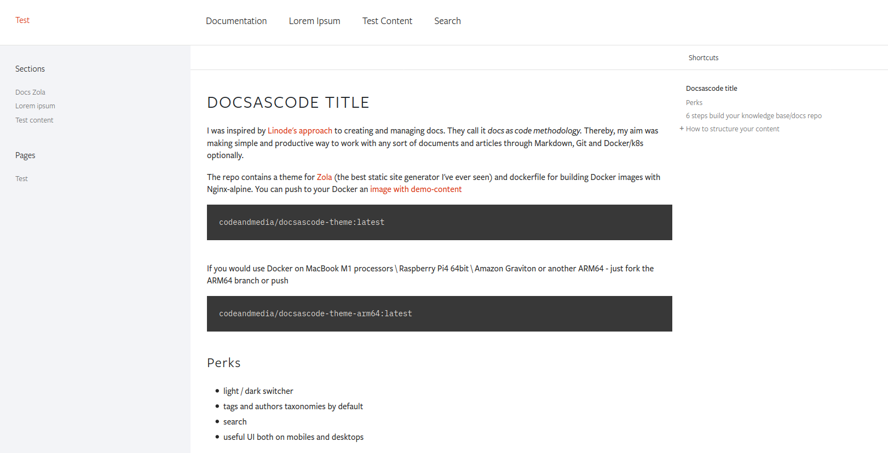

# Information

This [zola](https://github.com/getzola/zola) theme is based on two themes:

- zola theme [Docsascode_theme](https://github.com/codeandmedia/zola_docsascode_theme)
- sphinx theme [Catalyst Sphinx Theme](https://github.com/catalyst-team/catalyst_sphinx_theme.git)

I'm not a web developer, and the theme it's not really well made ... however it does its job, and that's good enough for me.

Here's a preview:

